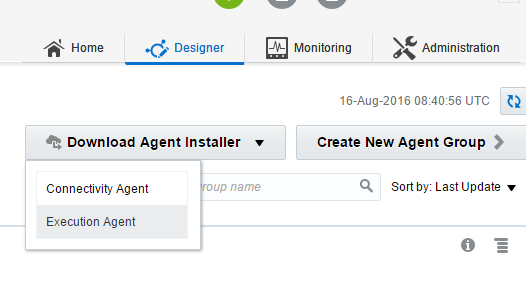

# Docker image for Integration Cloud Execution Agent

This project provides the sources to build a Docker image for the Execution Agent of the Oracle Integration Cloud. The main setup file must be downloaded manually before the image can be build.

During the creation of the Docker image to the main setup file is executed and will download additional setup files. Because of this the build process will take quite some time.

The Docker image is based upon Oracle Linux 6.8 and will install **sudo**, **tar** and **unzip**. The software will run as user **oracle**, which can execute commands as user **root** through **sudo** without a password!

## Folder structure

- assets
  - Contains images for **README.md**
- files
  - The main setup file should be put here
- iscea
  - The Docker configuration and install scripts are stored here
- temp_files
  - Can optionally store the other files to speedup the build process, otherwise these will be downloaded by the main setup file

## Download Execution Agent

The Execution Agent can be downloaden from within the Integration Cloud:

1. Login to the Oracle Cloud
2. Go to the Integration Cloud console
3. Click on **Designer**
4. Click on **Agents**
5. Click on the button **Download Agent Installer** and select **Execution Agent**

## Configuration

## Build instructions

## Save install files
